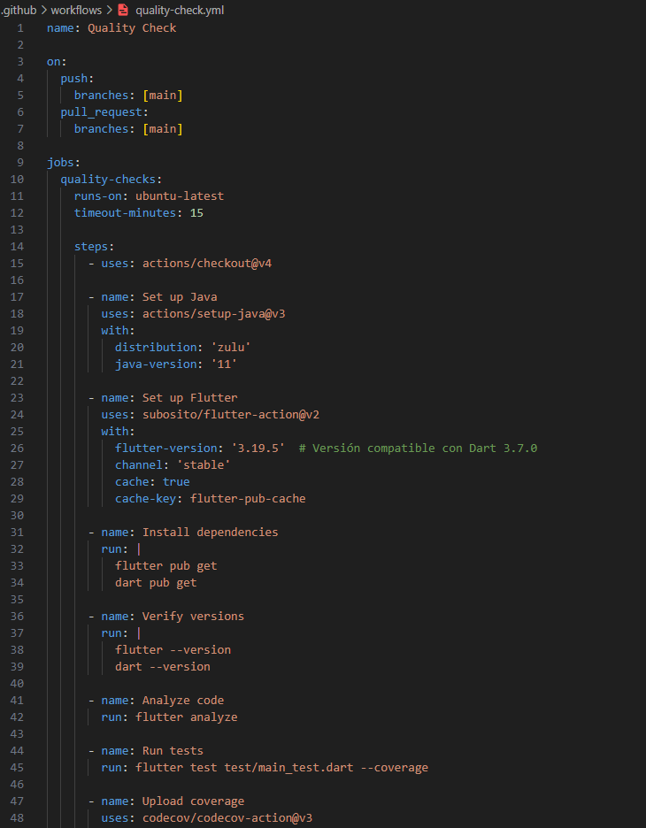
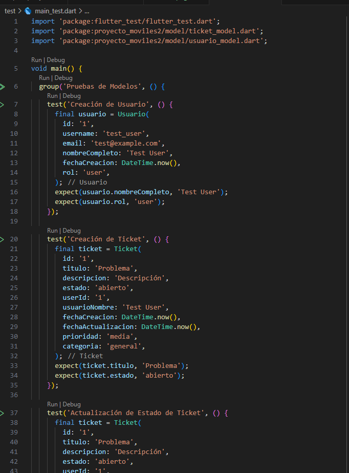
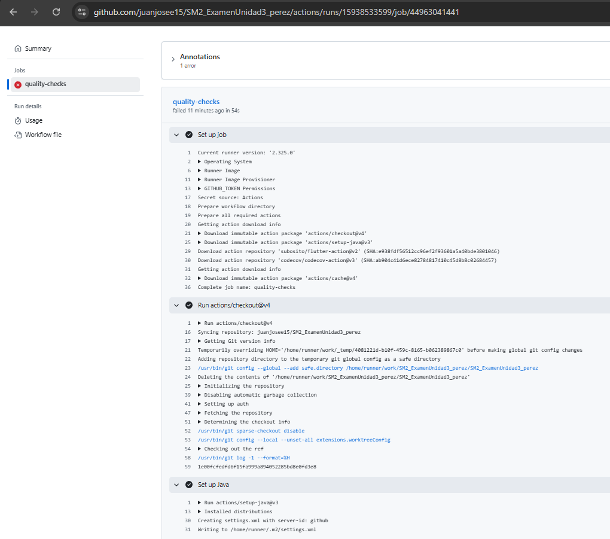
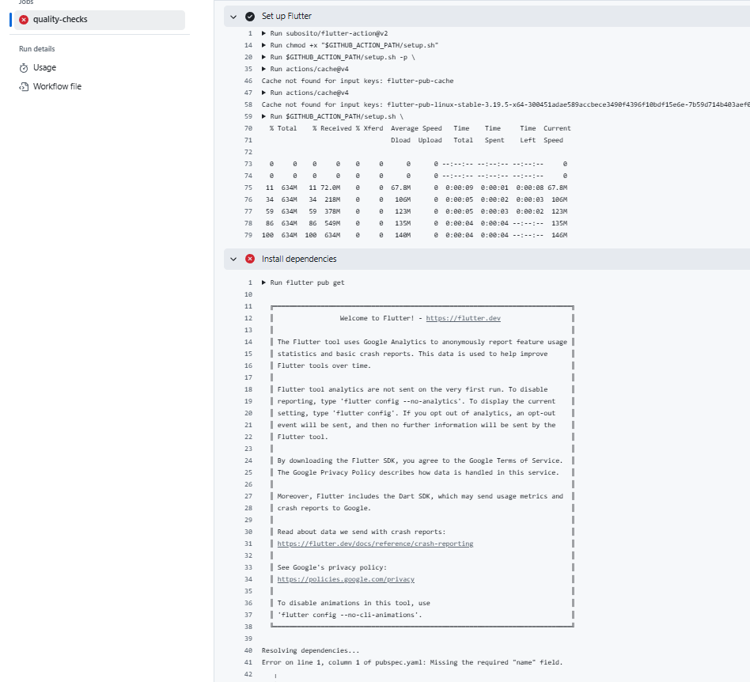
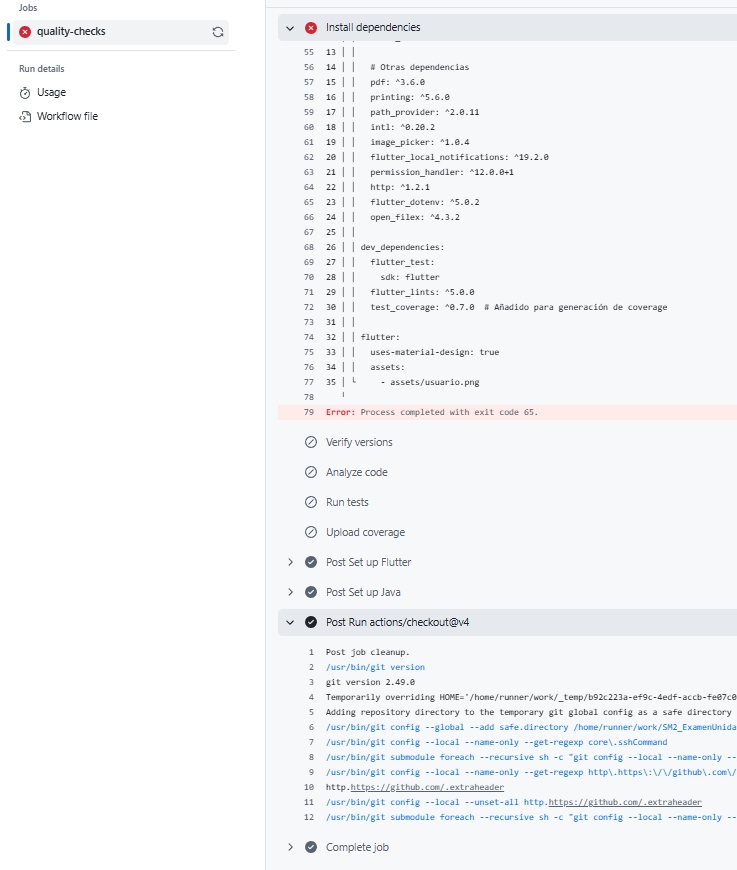

# SM2_ExamenUnidad3_perez
# Informe del Examen Práctico - Unidad III

## Datos del Estudiante
- **Curso:** Desarrollo de Aplicaciones Móviles  
- **Fecha:** [Fecha de entrega]  
- **Estudiante:** [Tu nombre completo]  

## URL del Repositorio
🔗 [https://github.com/juanjosee15/SM2_ExamenUnidad3_perez.git](https://github.com/juanjosee15/SM2_ExamenUnidad3_perez.git)

## Evidencias

### 1. Estructura de carpetas `.github/workflows/`
<!-- REEMPLAZAR CON TU CAPTURA -->

### 2. Contenido del archivo `quality-check.yml`
<!-- REEMPLAZAR CON TU CAPTURA -->

### 3. Ejecución exitosa del workflow
<!-- REEMPLAZAR CON TU CAPTURA -->

## Explicación de lo Realizado

1. **Configuración del Workflow**:
   - Se implementó un flujo automatizado en `.github/workflows/quality-check.yml`
   - Se ejecuta en cada `push` o `pull request` a la rama `main`
   - Incluye análisis de código (`flutter analyze`) y pruebas unitarias (`flutter test`)

2. **Pruebas Unitarias**:
   - 3 pruebas en `test/main_test.dart` verificando:
     - Creación de usuarios
     - Creación de tickets
     - Actualización de estados

3. **Resultados**:

---

